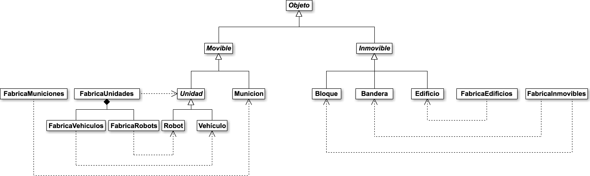
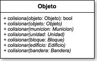
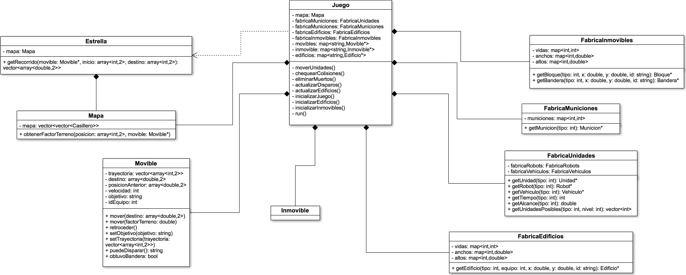
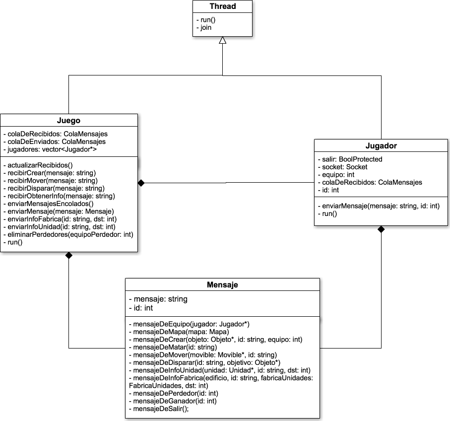
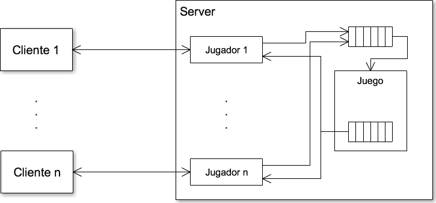
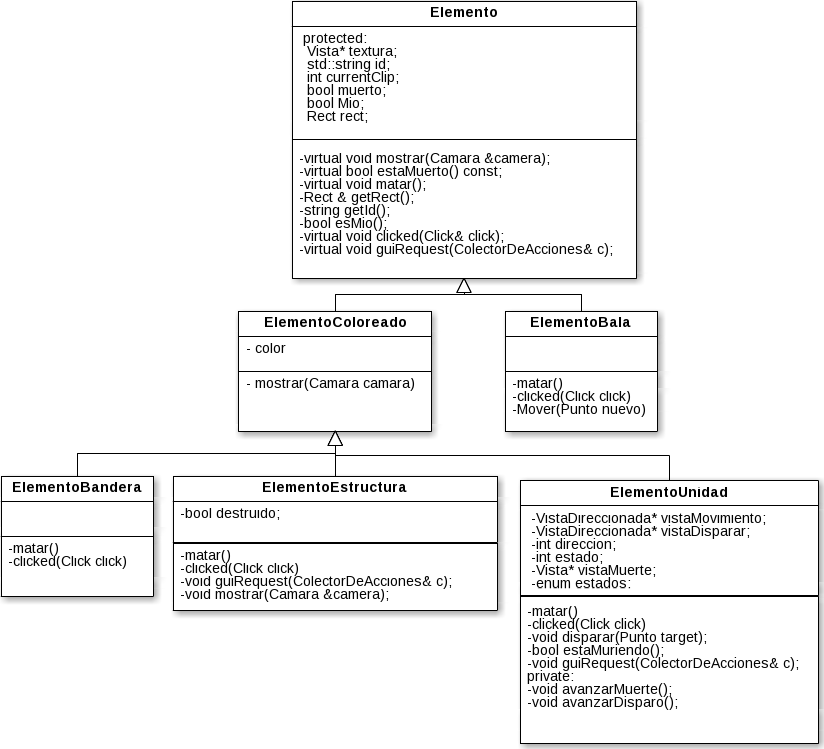
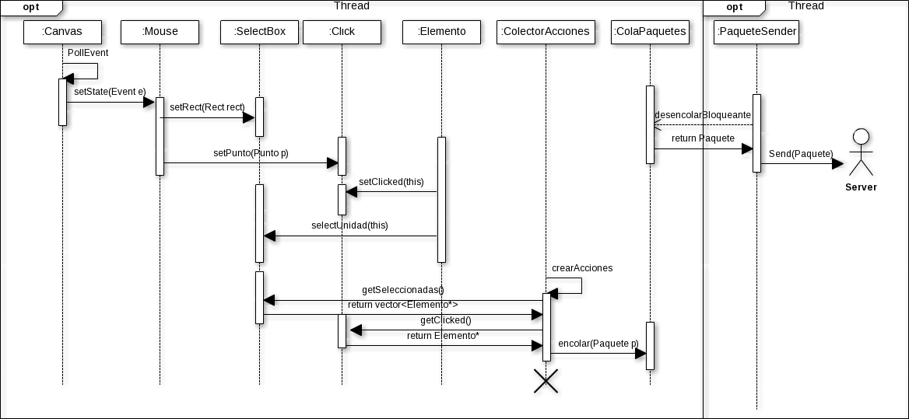

# Documentación Técnica

## Requerimientos de software
### SDL
Para correr el TP es necesario tener SDL2 instalado.
```
yum install SDL2-devel
apt-get install libsdl2-dev
```
También SDL_Image
```
yum install SDL2_image-devel
apt-get install libsdl2-image-dev
```
Y por último SDL_ttf y SDL_Mixer
```
yum install SDL2_ttf-devel
apt-get install libsdl2-ttf-dev
yum install SDL2_mixer-devel
apt-get install libsdl2-mixer-dev

```

### tinyXML2
También es necesario tener TinyXML2 instalado.

```
apt-get install libtinyxml2-dev
```
Para tener la versión más nueva se puede usar el código fuente del github del protyecto: https://github.com/leethomason/tinyxml2. Instrucciones para instalar la librería usando el código fuente del Repositorio pueden encotnrarse aquí: https://charmie11.wordpress.com/2014/03/24/script-for-install-tinyxml2-on-ubuntu/ (recurso en inglés).

### Make
Una vez instaladas las librerias
```
cd build
cmake ..
make
```

### Ejecución
Esto generara el ejecutable **vista** dentro de la misma carpeta client, el ejecutable **server** dentro de la carpeta server y el ejecutable **generador** dentro de la carpeta generadorMapa.

Principalmente se debe generar un mapa mediante:
```
cd generadorMapa
./generador
```
Este generara un archivo ```mapa.map``` y un archivo ```configuracion.xml```. El primero contiene los territorios del mapa, y el segundo las posiciones de los objetos iniciales en el mapa. Ambos deben ser movidos a la carpeta server.

Para correr el tp se debe correr primero el servidor especificando:
```
cd server
./server <puerto> <#jugadores>
```

y luego la cantidad de clientes necesarios, ejecutando consecutivamente:
```
cd client
./vista <ip> <puerto>
```

## Descripción general

Como se mencionó anteriormente el trabajo consta de tres partes principales, un servidor, un cliente y un generador.
El servidor contiene al modelo del Juego y se encarga de la lógica del mismo. El cliente, se comunica constantemente con el servidor y se encarga de reflejar lo que sucede en el modelo de forma visual. Por último, el generador de mapas es el encargado de generar las configuraciones iniciales del juego, que son leidas al inicializarse el juego en el server.

### Server
#### Descripción general
La parte fundamental del servidor es el modelo, el cual se encarga de manejar los sucesos y funcionamientos del juego. Pero además, este modelo requiere de "representantes" de los clientes dentro del servidor, los cuales se encargan de realizar las comunicaciones con los clientes.

#### Clases
- __Juego__: Es la clase principal del modelo. Esta clase contiene a los jugadores, a los objetos (Unidad, Edificio, Bandera, Bloque, etc), a las fábricas de los objetos (FabricaUnidades, FabricaMuniciones, FabricaEdificios, FabricaInmovibles) y a dos colas de mensajes (una para recibir y otra para enviar). Esta clase hereda de Thread, puesto que se busca que se ejecute en un hilo propio. El ciclo principal del juego se encuentra en el método ```run```, en él se va llamando a los métodos ```chequearColisiones```, ```eliminarMuertos```, ```actualizarDisparos``` y ```actualizarEdificios```. Estos métodos se encargan de actualizar el modelo en base a las acciones realizadas por los jugadores (recibidas en ```actualizarRecibidos```), y posteriormente se envían estas actualizaciones a los jugadores (mediante ```enviarMensajesEncolados```).
- __Jugador__: Esta clase se encarga de representar a los clientes dentro del servidor, es decir es la que permite establecer las comunicaciones. Al igual que juego, ésta hereda de Thread, ya que cada uno de los jugadores deben estar esperando información de los clientes de forma simultanea. Por lo tanto, en el método ```run``` el Jugador está constanmente esperando recibir mensajes, los cuales se encolan en la colaDeRecibidos (la misma cola que tiene el servidor). Además contiene un método enviarMensaje que permite establecer una comunicación con el cliente en el sentido inverso al anterior. Estas comunicaciones son posibles ya que contiene un atributo Socket.
- __Objeto__: Todos los objetos presentes en el mapa heredan de Objeto (cuenta con caracteristicas básicas como son la vida, posicion, diensiones, un identificador y un tipo). Mediante el double dispatch hace posible el chequeo de colisiones entre distintos tipos de objetos, actuando en cada caso en consecuencia. De esta clase heredan __Movible__, __Inmovible__, cada cual con sus herederos respectivos (__Unidad__, __Municion__, __Bandera__ y __Bloque__).
- __Fabricas__: La creación de los distintos elementos integrantes del modelo se realiza mediante fábricas. Éstas continenen las características particulares de cada tipo de objeto (leidas mediante xml al ser instanciadas) y las van cargando en los objetos devueltos. El modelo contiene varios tipos de fábricas: __FabricaUnidades__, __FabricasTerrenos__, __FabricaMuniciones__, __FabricaInmovibles__, __FabricaEdificios__, etc. En general el método más importante de lás fabricas es el que devuelve un elemento del que es fabricado (ejemplo, getUnidad, getTerreno, getMunicion, etc.), pero además, en algunos casos, se utiliza para conocer de forma externa algunas características de los mismos (getAlcance, getTiempo, etc.).
- __AEstrella__: Es una clase que se encarga de calcular los recorridos AEStrella para cada tipo de unidad (para eso utiliza la función ```getRecorrido```), desde una posición de origen a una de destino.

#### Diagramas UML

En primer lugar, para lograr entender el modelo, es necesario comprender cómo están relacionados los objetos que están involucrados en el mismo. Como se mencionó anteriormente, todos los objetos que forman parte del juego propiamente dicho heredan de la clase __Objeto__. En el siguiente diagrama de clases se puede observar cómo se relacionan los mismos.



Como se puede ver, hay dos clases principales que tienen como padre __Objeto__, estas son __Movible__ e __Inmovible__. Como sus nombres lo indican, la diferencia entre estos es que los objetos del primer grupo tienen la logica necesaria para poder moverse, mientras que los del segundo grupo no.
A su vez, de __Movible__ heredan __Unidad__ y __Munición__. __Unidad__ incluye a los personajes que pueden ser movidos por los jugadores correspondientes. Las unidades guardan la lógica necesaria para realizar disparos y capturar banderas. __Municion__ es la clase que representa a las balas generadas cuando una __Unidad__ desea efectuar un disparo. 
Por otro lado, de __Inmovible__ se observa que se desprenden __Bloque__, __Bandera__ y __Edificio__. El primero, es simplemente un objeto que ocupa un espacio en el mapa, el segundo ocupa un espacio en el mapa pero además al pasar una __Unidad__ por el mismo la bandera es capturada, y por último en __Edificio__ se guarda la lógica de la creación de unidades (desde el punto de vista del modelo, no es la clase que genera las instancias de __Unidad__).

Dicho esto, es importante mencionar que esta estructuración permite que cualquier objeto pueda colisionar con cualquier objeto, y que internamente dependiendo de las clases de los mismos, las colisiones se manejen según correspondan. Veamos simplemente los métodos de __Objeto__ que permiten esto:



Como se puede ver, todo objeto debe saber colisionar con cualquier instancia de una clase heredra de Objeto (es decir, deben tener implementados esos métodos).

Pero la clase principal del modelo, no es __Objeto__, sino __Juego__. Esta clase es la más extensa e importante del mismo, y tiene la funcionalidad principal de __manejar y modificar los estados del modelo__. Pero estas modificaciones deben ser desencadenadas a partir de mensajes recibidos del cliente. Por lo tanto el __Juego__ debe también __interactuar con los jugadores__. Por lo tanto, se puede decir que es una clase con dos "caras". 

Veamos la primera:



Se puede observar que los métodos que están involucrados son:
- ```moverUnidades```: Como su nombre lo indica, se encarga de mover los movibles, tanto de la clase Robot, como Vehículo y Munición.

- ```chequearColisiones```: Verifica si hay objetos que están colisionando, y en caso de colisión llama a los métodos colisionar para que ocurra la interacción esperada.

- ```eliminarMuertos```: Elimina todos los objetos que estén muertos (con vida menor a 0).

- ```actualizarDisparos```: Si una Unidad debe generar un nuevo disparo, realiza el disparo creando la nueva Munición correspondiente.

- ```actualizarEdificios``: Si un Edificio debe generar una nueva unidad, crea la nueva Unidad.

Además de una serie de métodos de inicialización de Juego, y el método ```run``` en donde se inicia el hilo y con él, el ciclo de juego.

A fin de manejar el modelo, la clase Juego cuenta con las clases fábrica, que permiten generar los Inmovible y Movible que luego se almacenan también en la clase principal. Además, el Juego contiene un Mapa, y utiliza la clase AEstrella para generar los caminos de las unidades.

Por otro lado, en lo que respecta a la interacción:



En primer lugar, en este diagrama de clases se puede observar que tanto Juego como Jugador heredan de la clase Thread. Es decir, los métodos run correrán en hilos separados.
Dentro de Juego, se observan una serie de métodos encargados de recibir mensajes y enviar mensajes. Estos mensajes se modelan en la clase Mensaje, la cual dependiendo del tipo de mensaje se encarga de generar y guardar el string que se enviará posteriormente a los clientes. El intercambio de mensajes con los clientes se realiza mediante la clase Jugador, la cual encola los mensajes recibidos en la colaDeRecibidos (posteriormente los lee el Juego) y va enviando mensajes desde servidor a medida de que el Juego llama a ```enviarMensaje```. 

A partir de este diagrama se introduce la concurrencia dentro del servidor, para aclarar un poco este funcionamiento se puede observar el siguiente esquema:



En este diagrama ilustrativo se puede observar la correlación uno a uno entre Jugador y Cliente. Por cada Cliente hay un Jugador en el modelo con el cual interactua. Una vez recibido los mensajes, cada Jugador encola los mensajes en una colaDeRecibidos, como lo ilustra el esquema. Estos mensajes luego son desencolados por el Juego, el cual los procesa, y encola nuevos mensajes para los clientes (en la colaDeEnviados). Luego, va desencolando los mensaje y los envía a cada uno de los jugadores para que los evíen a sus clientes.

Se puede observar que, dado que tanto los Jugadores como el Juego corren concurrentemente, la colaDeRecibidos puede llegar a intentar ser accedida por varios jugadores en simultaneo. Por lo tanto, esta es la principal fuente de _race conditions_ que puede existir dentro del servidor. Para evitar que se produzcan resultados no determinísticos por esta causa, se optó por proteger esta cola mediante el uso de un _lock_. Así, todo acceso (tanto de escritura como de lectura) está protegido.


#### Descripción de archivos y protocolos

De la lado del servidor los archivos utilizados son:

- ```mapa.map```: Posee los distintos territorios del mapa. Leido al generar el mapa. Generado por el generador de mapa.
- ```configuracion.xml```: Posee la configuración inicial del mapa, con las posiciones de los edificios e inmovibles iniciales. Leido al generar el mapa. Generado por el generador de mapa.
- ```terrenos.xml```: Archivo que posee las configuraciones de los distintos terrenos. Leido al inicializar la fabrica de territorios.
- ```edificios.xml```: Archivo que posee las configuraciones de los distintos edificios. Leido al inicializar la fabrica de edificios.
- ```inmovibles.xml```: Archivo que posee las configuraciones de los distintos inmovibles. Leido al inicializar la fabrica de inmovibles.
- ```municiones.xml```: Archivo que posee las configuraciones de los distintos municiones. Leido al inicializar la fabrica de municiones.
- ```robots.xml```: Archivo que posee las configuraciones de los distintos robots. Leido al inicializar la fabrica de robots.
- ```vehículos.xml```: Archivo que posee las configuraciones de los distintos vehiculos. Leido al inicializar la fabrica de vehiculos.

En cuanto a los protocolos de comunicación, serán explicados de forma conjunta (junto con los del cliente).

### Generador de Mapa

Pequeño sistema que se encarga de generar los mapas de forma aleatoria. Éste se desprende de las funcionalidades del servidor, por lo que no merece mayor desarrollo que una descripción general del algoritmo.

#### Descripción general
El algoritmo desarrollado para generar los mapas funciona a partir de la base de que "cuando un territorio ocurre, es muy probable que vuelva a ocurrir adyacentemente". Por lo tanto, si un casillero tiene un adyacente con territorio ya asignado, con una probabilidad muy alta elige el mismo territorio que el adyacente. Si tiene dos adyacentes con territorios, elige con esa misma probabilidad arbitrariamente alguno de los dos territorios (por como se itera la matriz como máximo tendrá dos adyacentes asignados). En caso contrario, se elige a partir de una serie de probabilidades de aparición de cada territorio.

### Client
#### Descripción general
El Cliente es el encargado de reflejar el estado de juego mediante animaciones y sonidos. Asimismo es el encargado de reportar todas las acciones del usuario al servidor, que serán luego reflejadas en el modelo del juego.

#### __Clases__
El funcionamiento general del cliente puede ser resumido a tres clases principales: __PaqueteReceiver__, __PaqueteSender__ y __Canvas__. Las primeras dos son las que se encargan de la comunicación por sockets con el servidor y la última es la que interactúa con el cliente y renderiza todo el juego.
***
##### PaqueteReceiver
Esta clase es la encargada de recibir los paquetes que llegan del servidor. Está constantemente recibiendo por el socket y cuando algo llega, lo encola en __ColaPaquete__ para que sea procesado por __Canvas__.
***
##### PaqueteSender
Aquí se envían los paquetes previamente encolados por __Canvas__.
***
##### Canvas
Esta clase es la que maneja todas las acciones del cliente y todas las visualizaciones, aquí es donde SDL es utilizado.
Las responsabilidades de esta clase son: interpretar todos los paquetes que llegan del servidor por medio de __PaqueteReceiver__, reflejar estos paquetes mostrando el estado del juego en la pantalla mediante el *GameLoop* y por último interpretar los eventos generados por el cliente para enviarle al servidor la acción que el usuario quiso llevar a cabo. En este sentido, el Cliente no es del todo "tonto". No se limita a informar "el cliente hizo click en x,y" si no que interpreta una cadena de eventos para enviar al servidor mensajes del tipo "Id x ataca a id y" o "pedir informacion de la unidad de id x", para dar unos ejemplos.
A continuación se hará una descripcion de las partes mas importantes que componen a esta parte del cliente.

###### Análisis de eventos
Los eventos soportados por esta aplicación son: movimiento del mouse, click del mouse, apretar la barra espaciadora, apretar las teclas w,a,s,d y cerrar la ventana.
* __Mouse__: Esta clase se encarga de registrar los eventos relacionados al mouse. Cuando detecta que se quiso hacer una seleccion (arrastrar apretando el botón derecho), le infroma a la clase __SelectBox__ de qué dimensiones es el rectángulo de selección creado. Cuando detecta un click izquierdo le informa a la clase __Click__ las coordenadas del mismo. En __SelectBox__ quedarán guardadas las unidades seleccionadas y en __Click__ el elemento clickeado.
* __ColectorDeAcciones__: Aquí es donde se interpretan los contenidos de __SelectBox__ y __Click__ y se decide cuál fue la acción específica que quiso realizar el usuario. Una vez determinada la misma aquí mismo se arma el Paquete y se encola en __ColaDePaquetes__, cola compartida con __PaqueteReceiver__.
* __Camara__: Camara es básicamente un rectángulo __Rect__ contra el cuál se comparan todos los elementos del mapa para ver si hay una colisión. Si la hay, el elemento será mostrado. La cámara se puede mover usando w,a,s,d para moverse en las cuatro direcciones y usando la barra espaciadora se vuelve en un solo movimiento al fuerte del jugador.

###### Reflejando el estado del modelo
En el cliente hay una relación uno a uno con todos los elementos existentes en el modelo del servidor. Todos los elementos son de clase __Elemento__ con una __Vista__, que es la que contiene a la imagen que representará al elemento en pantalla. __ElementoManager__ y __VistaManager__ son las clases que coordinan el acceso y creación de estas clases respectivamente.
* __Elemento__: compuesto por un puntero a una __Vista__ y un rectángulo __Rect__. El mismo reflejará la posición del elemento renderizándose la imagen pertintente sobre él y también se utilizará para registrar clicks sobre el __Elemento__, entre otros atributos.
* __Vista__: hereda de __Texture__ que es una clase que simplemente encapsula a SDL_Texture. Hay una __Vista__ por cada tipo de elemento que existe en el juego. Una __Vista__ contiene la imagen entera de animaciones que componen a un elemento del juego. Por ejemplo, la vista de un Fuerte es una imagen que contiene varios cuadros de la animación del mismo más un cuadro extra que se muestra al ser destruido, asimismo  la imagen contiene a todas las animaciones del mismo elemento pero de diferentes colores. Lo positivo de este enfoque es que se cargan pocas imágenes en memoria y además todos los elementos de un mismo tipo comparten una misma __Vista__.
* *manejarPaquetes*: Aquí se desencolan los paquetes de la __ColaPaquetes__. Este método es el que define qué hay que hacer con cada __Paquete__, hay tres tipos: __PaqueteAccion__, que es enviado a __ElementoManager__; __PaqueteUnidad__, que es enviado al __Hud__ (dónde se muestra la vida de la unidad seleccionada); y por último __PaqueteFabrica__, usado por __GuiFabrica__ para mostrar al usuario las distintas unidades que la fábrica puede construir. También en *manejarPaquetes* se reproducen sonidos para informar al usuario de algunos __Paquetes__ que merecen la atención del usuario.

###### Recorrido por el GameLoop
1. Al comienzo se resetean los __Timers__ que se usan para controlar los FPS para que las animaciones se vean con fluidez pero sin estar demasiado aceleradas.
2. Luego se manejan todos los paquetes que hayan llegado y se actualizan los __Elementos__.
3. *SDL_PollEvent* devuelve los eventos ocurridos y son manejados por la __Camara__ y el __Mouse__.
4. Se enfoca la __Camara__ , se limpia la pantalla y se muestran los __Tiles__.
5. Se muestran los elementos y se los hace "vivir", es decir, se avanzan las animaciones y se limpia a los muertos.
6. Se muestran las guis de las unidades y fábricas si corresponde.
7. Se actualiza la pantalla.
8. El __ColectorDeAcciones__ identifica las acciones y encola los __Paquetes__ en la cola de salida.
9. Se calcula el tiempo que tiene que dormir __Canvas__ para cumplir con los FPS seteados.
***

#### __Concurrencia__
Debido a la necesidad de mostrar constantemente animaciones por pantalla  monitoreando las acciones del usario al mismo tiempo que se envían y reciben mensajes por __Sockets__, se tuvo que hacer una implementación concurrente del juego. El juego está compuesto de 3 __Threads__. La principal es la que hace la primer conexión con el servidor y luego corre __Canvas__. Las otras dos threads son __PaqueteReceiver__ y __PaqueteSender__, ambas cuentan cada una como se mencionó anteriormente con una __ColaPaquetes__. Esta implementación de cola contiene __Paquetes__, está protegida con mutexes y tiene dos versiones de *desencolar*: una normal y una bloqueante. *desencolarBloqueante* es utilizado por __PaqueteSender__ para que no esté constantemente chequeando si hay algo en la cola para enviar, directamente intenta desencolar y se quedará bloqueado allí hasta que entre un nuevo __Paquete__ en la cola. __PaqueteReceiver__ simplemente se queda bloqueado en *Socket::Receive* hasta que haya algo para recibir.


#### Diagramas UML

__Herencia de Elementos__: En este diagrama se puede apreciar como funciona la herencia entre los distintos elementos que pueden ser representados en el mapa, estos elementos son los que se corresponden uno a uno con los que viven en el modelo del servidor. 
Se optó por separar a estos elementos por la forma en que se representan y no a lo que representan, es decir, no hay diferencia entre tanque y robot por ejemplo, porque ambos están compuestos de Vistas, que aunque distintas, sus imágenes son recorridas y mostradas de la misma manera. Lo mismo pasa con los distintos tipos de fábricas.
ElementoColoreado cubre a todos los elementos que son de algún equipo y por lo tanto el clip de la Vista que se muestra en cada caso, debe corresponderse con el color del elemento. Es esta clase quien se encarga de sumarle al clip de animación el offset necesario para mostrar el color correcto.
ElementoUnidad tiene más métodos que sus predecesores, debido a que una unidad tiene varias animaciones distintas que deben ser mostradas en distintas ocasiones. 
ElementoUnidad maneja el estado, que puede ser disparando, caminando o muriendo. En cada caso la clase se encarga de pedirle a las Vistas solo los clips de animación que corresponden a cada estado.

#### Descripción de archivos y protocolos

### Descripción de protocolos

**Todos los paquetes son precedidos por su largo, un int de 4 bytes. Estos no serán incluidos en los mensajes a continuación:

#### Paquetes que envía el Cliente
##### Mover

comando | id | x | y
--- | --- | --- | ---
2 | 007 | 00001 | 00001
1 char | 3 chars | 5 chars | 5 chars

##### Crear
Lo van a enviar las fabricas

comando | id | x | y | tipo 
--- | --- | --- | --- | --- 
0 | 007 | 00001 | 00001 | 09 
1 char | 3 chars | 5 chars | 5 chars | 2 chars 

##### PedirInfo
Se va a enviar cuando el usuario hace click sobre una unidad o fábrica.

comando | id |
--- | --- |
4 | 007 |
1 char | 3 chars |

##### Disparar

comando | id | id
--- | --- | ---
3 | 007 | 001
|| agresor | agredido
1 char | 3 chars | 3 chars

#### Paquetes que envía el Servidor

##### Mover

comando | id | x | y
--- | --- | --- | ---
2 | 007 | 00001 | 00001
1 char | 3 chars | 5 chars | 5 chars

##### Crear
Lo van a enviar las fabricas

comando | id | x | y | tipo | color
--- | --- | --- | --- | --- | --- 
0 | 007 | 00001 | 00001 | 09 | 2 
|||||| equipo de 0 a 3 |
1 char | 3 chars | 5 chars | 5 chars | 2 chars | 1 char

##### Disparar

comando | id | x | y
--- | --- | --- | ---
3 | 007 | 00001 | 00001
|| disparador ||
1 char | 3 chars | 5 chars | 5s chars

##### Matar

comando | id |
--- | --- |
1 | 007 |
|| el/lo que murio |
1 char | 3 chars |

##### Informacion

###### Caso Unidad:

comando | id | tipo | vida | 
--- | --- | --- | --- |
4 | 007 | 09 | 100 |
||| tipo unidad | %vida que le queda |
1 char | 3 chars | 2 chars | 3 chars |

###### Caso Fabrica:

comando | id | tipo | vida | cant q puede construir | tipo 1 | tiempo 1 | tipo 2 | tiempo 2 | ... | esta construyendo? | tipo construyendo | %construido
--- | --- | --- | --- | --- | --- | --- | --- | --- | --- | --- | --- | --- |
7 | 007 | 03 | 100 | 02 | 09 | 0100 | 10 | 1400 | ... | 1 | 09 | 010 |
||| fuerte | %vida que le queda | cuantas unidades sabe construir | tipo pyro | segundos |tipo sniper | segundos | ... | bool | tipo en construccion(si el anterior fue true) | % que ya se construyo (si el bool fue true) |
1 char | 3 chars | 2 chars | 3 chars | 2 chars | 2 chars | 4 chars | 2 chars | 4 chars | ... | 1 char | 2 char | 3 char |

##### Enviar Mapa #####

comando |  tiposTiles |
--- | --- |
1 char | 200x200 chars de ints| 


