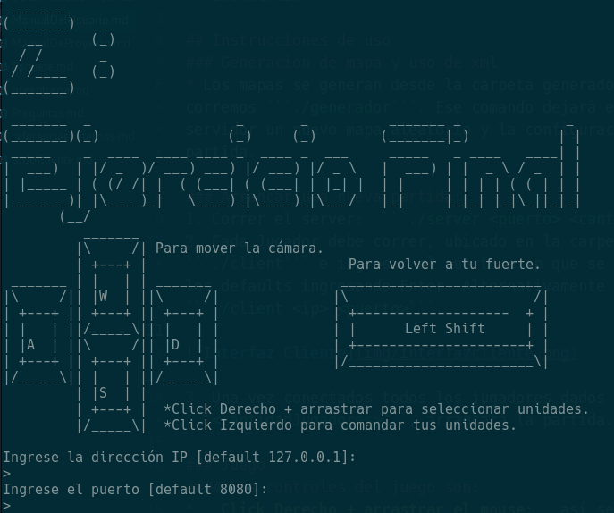
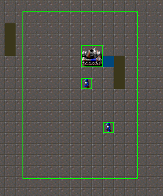
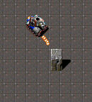
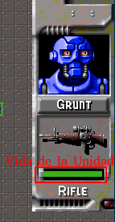
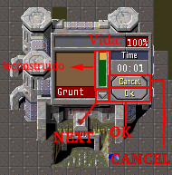

# Manual del usuario


## Instalación

## Configuración
La configuración de los los distintos elementos que conforman el juego son configurables por xml. Los archivos donde se encuentran las configuraciones son:

- edificios.xml: Presenta las configuraciones de todos los tipos de edificios (Fuerte, Fabrica de Robots y Fabrica de Unidades).
- inmovibles.xml: Presenta las configuraciones de los otros tipos inmovibles (Bandera o Bloque).
- municiones.xml: Presenta las configuraciones de todos los tipos de municiones.
- robots.xml: Presenta las configuraciones de todos los tipos de robots.
- vehiculos.xml: Presenta las configuraciones de todos los tipos de vehiculos.
- terrenos.xml: Presenta las configuraciones de todos los tipos de terrenos.

Estos archivos deben estar presentes en la carpeta server. Los archivos son bastante claros, y presentan comentarios en los casos necesarios, por lo que si se desea modificar alguna configuración, simplemente alcanza con modificar el campo deseado.

Además existen dos archivos más que son generados por el generador de mapas, estos son:

- mapa.map: Presenta los terrenos de cada uno de los casilleros.
- configuracion.xml: Presenta las posiciones iniciales de cada uno de los inmovibles (Edificios, Banderas o Bloques).


## Instrucciones de uso
### Generacion de mapa y uso de xml
* Los mapas se generan desde la carpeta generadorMapa, desde allí corremos ```./generador```. Ese comando dejará en la carpeta del servidor un nuevo mapa aleatorio y la configuración inicial de la partida.

### Arrancar una nueva partida:
1. Correr el server:  ```./server <puerto> <cantidadJugadores>```
2. Cada Jugador debe correr, ubicado en la carpeta client, ```./client``` e ingresar el puerto e ip que se desea usar o usar los defaults ingresando Enter. Alternativamente se puede optar por ```./client <ip> <puerto>```



3. Una vez conectados todos los jugadores dados en ```<cantidadJugadores>```, arrancará la partida.

### Juego
#### Los controles del juego son:
* __Click Derecho + arrastrar el mouse:__ así seleccionamos nuestras unidades que querramos controlar. Las unidades quedarán seleccionadas hasta que se haga una nueva selección.


* __Click Izquierdo:__ lo usamos para hacer que las unidades seleccionadas ataquen a un enemigo y se dirijan a un punto del mapa, o para obtener información de las unidades y las fábricas.


* __Teclas W,A,S,D:__ para movernos sobre el mapa.
* __Shift Izquierdo:__ para volver rápidamente a nuestro fuerte.

#### HUD
El HUD nos muestra información de la unidad seleccionada, como la cantidad de vida que le queda, su tipo y las armas que posee. Lo abrimos haciendo click sobre la unidad que nos interesa y los cerramos clickeando sobre el HUD.


#### Interfaz fábrica
Si hacemos click sobre una de nuestras fábricas, aparecerá esta interfaz. Aquí podemos ver qué unidades puede construir la fábrica, sus tiempos de construccion, los vida que el queda a la fábrica.
Si una unidad está en construcción, aparecerá una barra de progreso indicando su porcentaje de construcción. Para mandar a construir una unidad, la elegimos primero con el botón NEXT, y luego confirmamos con OK. Para salir de la interfaz, apretamos CANCEL.



#### Finalización del Juego
Al ser un juego multiplayer online, si alguna de las conexiones de algún jugador se cae, el juego terminará.
Cuando un jugador pierde, se le informará, será desconectado del server y el juego se cerrará.
Cuando un jugador gané la partida, también se le informará y luego se cerrará el juego.
